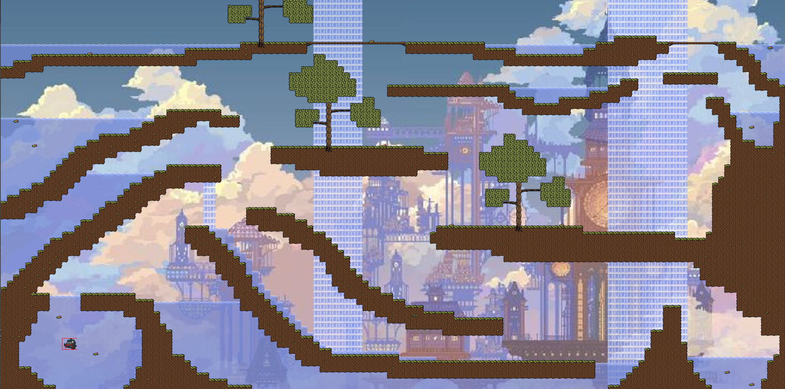
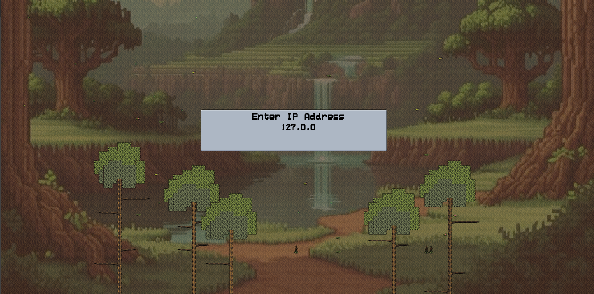

# Fish Game 🐟



#### Combat Mode

 Fish Game is a fast-paced 2D action-adventure where players take control of a daring fish jumping on plattforms filled with water, landscapes filled with obstacles. Dive deep into various aquatic environments and outsmart your friends! Swim swiftly through danger, pick your weapons and avoid the bullets from your opponents!



#### Join another host

## Controls

**Players can:**

- move using **w, a, s, d**
- pick up weapons pressing **j**
- shoot up to 5 times pressing **k**
- jump one time after leaving the water

## Build

#### Dependencies

We use conan to install the Dependencies.
So first install conan then the buildilng commands should work successfully

The Dependencies are specified in the conanfile.txt file

#### Installing Conan

First install conan by using pipx:

```
pipx install conan
```

Then create a conan profile

```
conan profile detect --force
```

Now you can install all Dependencies using conan for Release and Debug configurations:

```
conan install . --build=missing
conan install . --build=missing -s build_type=Debug
```

#### Building fish_game using presets requirering cmake>=3.23

```
cmake --preset conan-debug
cmake -B build/Debug --preset conan-debug
cmake --build --preset conan-debug
./build/Debug/fish_game


cmake --preset conan-release
cmake -B build/Release --preset conan-release
./build/Release/fish_game
```

## Specification (12 Points total)

### 1. Networking (3 points)

- Create Interface for commands
  - i. Server-side
  - ii. Client-side
- LAN
- WAN
- Assign different colors/outfits for players

### 2. Maps (1 point)

- Many, small combat maps with different physics (levels)
- Water
- Land
- Main menu "map"

### 3. Basic Movement (2 points)

- Swimming
- Jumping out of the water to another platform
- Adjust speed depending on being on land or in water

### 4. Advanced Movement (1 point)

- Feign dead

### 5. Player Movement Animations (1 point)

- Swimming
- Hopping on land
- Jumping out of the water

### 6. Menus (1 point)

- Main menu
- Join Game
- Host Game
- Exit
- Host menu
  - Select number of rounds
  - Map selection or random selection
- Pause menu
  - Continue
  - Leave game

### 7. Main Combat (2 points)

- Picking up/dropping range weapons (e.g. pistols)
- Shooting other fishes
- Teleport to next map after each round

### 8. Sounds (1 point)

- Background music, different for main screen and combat map
- Sound effects (water splash, jumping, shot fired)

## Contributions

**Fabian Aster:**

- NetworkClient.hpp/cpp
- NetworkHost.hpp/cpp
- SocketManager.hpp/cpp
- GameInputEvents.hpp/cpp
- MusicPlayer.hpp/cpp
- Player.hpp/cpp
- ServerGame.hpp/cpp
- ClientGame.hpp/cpp
- main.cpp
- conanfile.py
- Music files

**Leopold Schmid:**

- AssetManager.hpp/cpp
- Auxiliary.hpp/cpp
- ClientGame.hpp/cpp
- Collision.hpp/cpp
- ECS.hpp/cpp
- FontManager.hpp/cpp
- Map.hpp/cpp
- ServerGame.hpp/cpp
- TextureManager.hpp/cpp
- Vector2D.hpp/cpp
- ClientComponent.hpp/cpp
- ColliderComponent.hpp/cpp
- ComponentsGenerator.hpp/cpp
- EquipmentComponent.hpp/cpp
- EventHandlerComponent.hpp/cpp
- GravityComponent.hpp/cpp
- HealthComponent.hpp/cpp
- MoveComponent.hpp/cpp
- ProjectileComponent.hpp/cpp
- ServerComponent.hpp/cpp
- SpriteComponent.hpp/cpp
- TransformComponent.hpp/cpp
- WearableComponent.hpp/cpp
- main.cpp
- Maps + assets

**Friedrich Hartmann:**

- MockServer.hpp/cpp
- ComponentsGenerator.hpp/cpp
- conanfile_deprecated.txt
